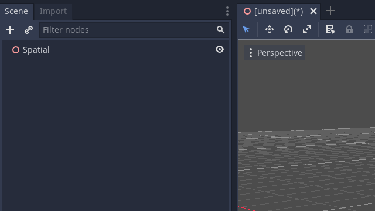
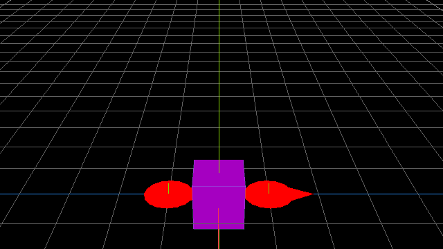
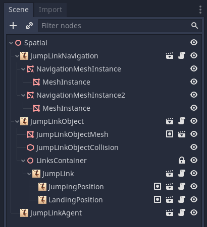

# Godot 3D Navigation Jump Links

[](https://youtu.be/iNdomkaKEEM)


Navigation Jump Links Addon for Godot Game Engine 3.2+

## Features | Examples:
- Create non-conventional traversal options for both AI agents and players.
- Uses jumpnode markers so agents can jump, climb and slide around the map
- Connects otherwise disconnected navmeshes for pathfinding.
- Precalculated paths for minimal performance impact at runtime
- (optional) Requirement tag to permit jumplink usage only for certain agent types
- (optional) Artificial weight value to encourage/discourage AI agents from using jumplinks
- (optional) Animation tag to trigger transition animations on agents
- (optional) Curve3D and Pathfollow support to customize jump trajectory
- Multiple demo levels to study and copy from
- Ruby colors!


## Content
- [Why this addon?](#why-this-addon)
- [Installation](#installation)
- [Setup | Usage](#setup--usage)
- [Scenetree Example](#scenetree-example)
- [Addon node types](#addon-node-types)
    - [JumpLinkNavigation](#jumplinknavigation)
    - [JumpLinkObject](#jumplinkobject)
    - [JumpLink](#jumplink)
    - [JumpLinkPosition](#jumplinkposition)
    - [JumpLinkPath](#jumplinkpath)
    - [JumpLinkAgent](#jumplinkagent)
- [Limitations](#limitations)
- [How Agents choose their path](#how-agents-choose-their-path)
- [Demos](#demos)
- [FAQ](#faq)
- [License](#license)
- [Known issues](#known-issues)
- [ToDo](#todo)


## Why this addon?
Ever wondered why so many characters in 3D games can't follow a player around properly?
- When a player jumps over a gap an agent can't follow
- When a player climbs on a roof an agent finds no way up
- When a player uses any shortcut an agent takes a long walk
- When a player uses a game object for travel an agent has no idea what to do
- ...

Most games use a navigation mesh for 3D pathfinding but this alone is often very limited.
- Navmeshes are restricted to more or less flat surfaces with a few slopes. 
- Navmeshes require placement in very close proximity to each other to be considered in a path.
- Vertical movement is only supported by building ramps that must have a certain max angle.
- ...

Game engines like Unreal (Jumplink) and Unity (Off-Mesh Link) provide some basic support for jumping agents.
Godot has none and this addon tries to fix this by enabling new pathfinding and gameplay options that work for both player and AI.

... to be honest I needed parkour pathfinding for my own game project.
As it stands the reworked pathfinding in Godot 4.0 is still very limited so a homebrew implementation was the only option left.

- Agents can now find full paths across marked navigation meshes
- Agents will now consider using game objects to travel faster
- Agents can now follow players everywhere as long as a single connection exist 
- Works for AI agents, player controlled point&click and buttonpress interactions.
- Agents can and will use an unlimited number of links to reach a target.
- Precalculated paths for nearly zero added runtime cost compared to default navigation
- Agents are completely restricted to designer placed pathing nodes, no random behaviour or raycast surprises.

## Installation

1. Copy the 'navigation_jump_links' folder and its content into the projects 'res://addons/' folder.
2. ~~In the Editor go to Project Settings -> Plugins~~
3. ~~Enable the 'Navigation Jump Links' Plugin.~~

## Setup | Usage



1. Add a `JumpLinkNavigation` node to the scene (or replace existing `Navigation` node(s) ).
2. Add `NavigationMeshInstance` children like usual to the `JumpLinkNavigation` node.
For pathfinding performance and accuracy separate NavigationMeshInstance for each island are preferred.  Scenes with only one large navmesh for the entire map can result in agents getting stuck when islands are to small to be distinguishable between navmesh edges.
2. Add a `JumpLinkObject` node.
Warning! Nearly all autocreated child nodes are name and case sensitive, don't rename them without a very good reason!
New `JumpLinkObject` starts with one `JumpLink` pair that consists of a `JumpingPosition` and a `LandingPosition`. You can add as many new `JumpLink` node pairs to the `JumpLinkObject` node as you want as long as you place them all under the `LinksContainer` node.
3. Move and rotate `JumpingPosition` node to intended startposition
4. Move and rotate `LandingPosition` node to intended endposition
5. (optional) Jump trajectory is enabled by adding a `JumpLinkPath` node as a child of the `JumpLink` node. Adding it after placing `JumpingPosition` and `LandingPosition` will automatically create a curve with this positions as start- and endpoint. Add as many points as needed to form the desired curve movement.
6. Add a `JumpLinkAgent` node.
Use JumpLinkAgent.set_navigation() to assign the JumpLinkNavigation node that the agent should use.
Use JumpLinkAgent.set_movement_target() to move the agent to a Vector3 position in the scene.



## Scenetree Example



```bash
JumpLinkNavigation
├── NavigationMeshInstance
│   ├── MeshInstance
├── NavigationMeshInstance
│   ├── MeshInstance
JumpLinkObject
├── JumpLinkObjectMesh 
├── JumpLinkObjectCollision
├── LinksContainer
│   ├── JumpLink
│   │   ├── JumpingPosition
│   │   ├── LandingPosition
│   ├── JumpLink2
│   │   ├── JumpingPosition
│   │   ├── LandingPosition
│   │   ├── JumpLinkPath
JumpLinkAgent
```

## Addon node types

- [JumpLinkNavigation](#jumplinknavigation)
- [JumpLinkObject](#jumplinkobject)
- [JumpLink](#jumplink)
- [JumpLinkPosition](#jumplinkposition)
- [JumpLinkPath](#jumplinkpath)
- [JumpLinkAgent](#jumplinkagent)

All new nodetypes should show up in the addnode dialog through their class_name. Editor plugin types have bugs in Godot at the moment so they are disabled for this version.

Warning! Nearly all autogenerated childnodes are name and position sensitive, don't change them without a good reason!

### JumpLinkNavigation
Extended `Navigation` node that creates the jumplink mapping at scene start.
It can replace default `Navigation` nodes completely.

`JumpLinkAgent`'s internally call `JumpLinkNavigation.get_jumplink_path()` instead of get_simple_path() to aquire a jumplink path Array from this node.
```GDScript
func get_jumplink_path(_agent : Spatial, _target_pos : Vector3) -> Array:
    ...
    return [_path, _jumplink_node, _jumplink_nodepath]
```
JumpLinkNavigation.get_jumplink_path() return values:
```GDScript
var _jumplink_path : Array = get_jumplink_path(_agent, _target_pos)
_jumplink_path[0] -> Pathpoints to first JumpLink, usage same as get_simple_path()
_jumplink_path[1] -> First JumpLink node ref for interact() when close enough
_jumplink_path[2] -> Array with all JumpLink node refs for entire path to _target_pos
```

### JumpLinkObject
Extended `Area` node that groups an infinite number of `JumpLink` children and controls their usage.

(optional)
By adding `CollisionShapes` players can use raycasts or area events to interact with the same JumpLinks that AI agents use by calling the JumpLinkObject.interact(_agent) function.
Useful for non-default movement options to the player that should be shared with AI agents, e.g. sliding down a rope, using a rollercoaster or a teleporter warp. A player will move through the JumpLinkpath the same way like an AI agent would.

Export Variables:

- required_tag : String = ""

If not left empty (default), only agents that have this string inside their tags can use this node.
E.g. "can_climb" permits agents that have a "can_climb" tag to use all jumplinks of this node.

- weight_cost : float = 1.0

Weight cost is an artifical multiplier to encourage/discourage AI agents from taking the jumplinks of this JumpLinkObject. The real jumplink distance/timecost are multiplied by this value, e.g. a value of 0.5 halfs the jumplinks cost for pathfinding considerations while a value of 2.0 doubles it. Also consider increasing this value if agents have a very high movementspeed on ground navmesh.


### JumpLink
Holds a pair of `JumpLinkPosition` nodes to mark `JumpingPosition` and `LandingPosition`.
Adding an optional `JumpLinkPath` node enables jump trajectory pathfollow.

Export Variables:
- timecost : float = 1.0

Timecost value is the total time in seconds that an agent needs to travel from JumpingPosition to LandingPosition. AI agents facing multiple options for the same path will pick the closest jumplink with the lowest timecost.

- animation : String = ""

Animation string name that can be used to play animations in the jump_link() function on JumpLinkAgent's.

### JumpLinkPosition
Template positionmarker for a `JumpLink`'s `JumpingPosition` or `LandingPosition`. Since both are autogenerated after adding a `JumpLink` node this nodetype is only needed as a replacement if one is deleted by accident or to customize the appearance.

Export Variables:

- override_navmesh_path : NodePath

Overrides automatic navmesh matching for this jump position. Useful when positions are in very close proximity or overlapping.

### JumpLinkPath
(optional) Can be added as a child of a `JumpLink`.
Replaces the direct transform movement from `JumpingPosition` to `LandingPosition` with a custom `Curve3D` path that `JumpLinkAgent`'s will follow.
When added to the scene automatically adds a Curve3D resource with first and last curve index point from `JumpingPosition` and `LandingPosition` transform. Extra curve points between can be added as desired for the movement path.

### JumpLinkAgent
Template (script) for agents that want to use `JumpLink` nodes. Has basic pathmoving and follow target functionality. Can be extended and customized as long as core functions and signals are kept intact.

Export Variables:

- link_interaction_range : float = 0.5

Minimum distance to a targeted `JumpingPosition` before this agent can interact and use it. Should be adjusted to agent size and shape.

- jump_to_landing_distance : float = 0.25 

Minimum distance to a `LandingPosition` before this agent is considered as "landed". Should be adjusted to agent size and shape.

- jumplink_tags : Array, String = []

List of tags that enable this agent to use `JumpLinkObject`'s that have a tag requirement

- follow_target_link_timeout : float = 5.0

Time in seconds before the first followlink in queue gets automatically removed from this agent. Prevents agents from getting stucked forever under bad circumstance.

- follow_update_interval : float = 1.0

Time in seconds before this agent updates the path to a follow target. Should be set as high as possible to preserver performance. Should be set as low as needed to react fast enough to target position changes.


## How Agents choose their path
For building optimal scenes and to better guide agents pathfinding here are a few rules/considerations

- Agents have no limit how many jumplinks they can or will take.
- Agents try to be as fast as possible at the target position.
- Agents prefer JumplinkObjects with the lowest weight value.
- Agents prefer Jumplinks with the lowest timecost value.
- Agents on same navmesh will still use jumplinks as shortcuts over walking.
- Agent walkspeed is assumed 1 in all precalculated paths for comparisons.
Consider a general weightvalue increase on all jumplinkobjects when using agents with very high movementspeed multipliers or agents might pick slow jumplinks over faster, direct walkpaths.

## Limitations
- Agent movementspeed is not considered for weighting navmesh walkable terrain between jumplink nodes.

This would require a new mapping for each possible path for each possible speed value to be accurate or a calculation at runtime taxing performance quickly with many agents.
Consider a general weightvalue increase on all jumplinkobjects or working with tags to compensate for agents with very high movement speed.

- Navmeshes that are dead ends are not allowed.

The path mapping requires that all navigation meshes have at least one valid connection to enter and exit and at least one valid path to each other navmesh.
The mapping algo will throw a dictionary key error when a navmesh is not properly connected with at least one jumplink to enter or exit.
Instead of silencing this errors this was left on purpose as an early warning. Agents would immediately get stuck on this navmeshes after a jump.

## Demos
A few simple demo levels are included that reuse assets from the official Godot navmesh demo to showcase and test various setups and features

[](https://youtu.be/pjy6ajOa6Ms)
[](https://youtu.be/jijXbmYJYfM)
[](https://youtu.be/BRDGLp6CQpw)


## FAQ

### I found a bug / want to propose a feature
Always open to suggestions. Open an issue and/or reach out to me on a social channel.

### Can I change weight/timecost through script?
Yes but it will not change pathfinding considerations of agents immediately and only the interaction jump will be affected. To update the entire pathfinding after changes run `build_navmesh_links()` on the `JumpLinkNavigation` manually. This will turn any agent `get_jumplink_path()` call to a default `get_simple_path()` until the jumplink mapping is rebuild so agents are meanwhile unable to jump.

### My agent is stuck on small platforms
The automatic mapping is sometimes unable to match the right navmesh to jump positions or calculate paths between links that are in very close proximity or overlapping.
Consider navmesh override on the jumpposition nodes in question and also lowering size and merge values on the navmesh resource for more precision.

### I get dictionary key errors on scene load
The path mapping requires that all navigation meshes have at least one valid connection to enter and exit and at least one valid path to each other navmesh. The mapping algo will throw a dictionary key error when a navmesh is not properly connected with at least one jumplink to enter or exit. 

### I have a large map with many links and loading times are increasing
Calculate the link mapping only while developing and save the entire '_navmesh_mappings' dictionary on the `JumpLinkNavigation` node in a resource or JSON file for game export.
Then replace the 'build_navmesh_links()' function in the '_ready()' part of the `JumpLinkNavigation` node with a load from this file. This way your players don't have to spend loading time on creating a mapping on scene loads.

### I get error / warning msgs about missing viewport textures and paths
Known Godot issue. The error printer is faster than the node on first frame due to the way childnodes are processed. It should still work without problems and the viewports are for debug only so they can also be removed for release export.

### Does this work with Godot 4.0?
It was tested with a master build of Godot 4.0 some time ago on the new 3DNavigation and 3DNavigationAgents and worked without issues.
GDScript development added breaking changes to the scripts in 4.0 and I have no plans to update and maintain both version while it isn't more stabilized. I plan full support for Godot 4.0 on release.


## License
MIT

## Known issues

- Quirky code, some pointless strings and extra loops. Also see known limitations.

## ToDo

- Create unique icons to tell the different node types easier apart
- Backgroundthread option for (re)calculating the link mapping at runtime
- Add "baking" option for very simple movement types like jumping down or across. Automatically place jumplink nodes in a level based on height and distance values.